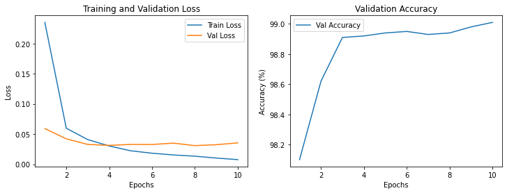

# Developing a MNIST Handwritten Digits Classifier with PyTorch

This project aims to build and improve a neural network model for classifying handwritten digits from the MNIST dataset using PyTorch. We employ a convolutional neural network (CNN) and utilize Grid Search for hyperparameter optimization to achieve high accuracy.

## Table of Contents

- [Introduction](#introduction)
- [Dataset](#dataset)
- [Model Architecture](#model-architecture)
- [Training](#training)
- [Evaluation](#evaluation)
- [Hyperparameter Optimization](#hyperparameter-optimization)
- [Results](#results)
- [Usage](#usage)
- [Conclusion](#conclusion)

## Introduction

The MNIST dataset is a classic dataset for handwritten digit classification. It contains 60,000 training images and 10,000 testing images of digits from 0 to 9. The goal of this project is to build a neural network that can classify these images with high accuracy.

## Dataset

The MNIST dataset is available in the `torchvision` library. We apply the following transformations to the data:

- Convert images to tensors.
- Normalize the images with a mean and standard deviation of 0.5.

## Model Architecture

We use a convolutional neural network (CNN) with the following architecture:

- **Conv1**: 32 filters, kernel size 3x3, stride 1, padding 1
- **Conv2**: 64 filters, kernel size 3x3, stride 1, padding 1
- **Max Pooling**: kernel size 2x2, stride 2
- **Fully Connected Layer 1**: 128 units
- **Fully Connected Layer 2**: 10 units (output layer)

## Training

The training process involves:

1. Defining the CNN model.
2. Setting up the loss function (`CrossEntropyLoss`) and optimizer (`Adam` or `SGD`).
3. Training the model for a specified number of epochs.
4. Logging the training and validation losses.

## Evaluation

We evaluate the model on the test set by computing the accuracy of the model. The test accuracy is calculated as the percentage of correctly classified images.

## Hyperparameter Optimization

To improve the model, we use Grid Search to find the best hyperparameters. We search over the following parameters:

- Learning rate: `[0.001, 0.0001]`
- Batch size: `[64, 128]`
- Optimizer: `['Adam', 'SGD']`

## Results

The best model achieved an accuracy of **98.94%** on the test set with the following hyperparameters:

- Learning rate: `0.001`
- Batch size: `64`
- Optimizer: `Adam`

### Training and Validation Loss & Validation Accuracy



## Usage

To run the training and evaluation scripts:

1. Install the required packages:

    ```bash
    pip install -r requirements.txt
    ```

2. Run the training script

3. Evaluate the model

4. Perform hyperparameter optimization

## Conclusion

This project demonstrates the process of building, training, and optimizing a neural network for handwritten digit classification. The use of a convolutional neural network (CNN) and Grid Search for hyperparameter tuning allowed us to achieve high accuracy on the MNIST dataset.

## License

This project is licensed under the MIT License. See the [LICENSE](LICENSE) file for more details.
